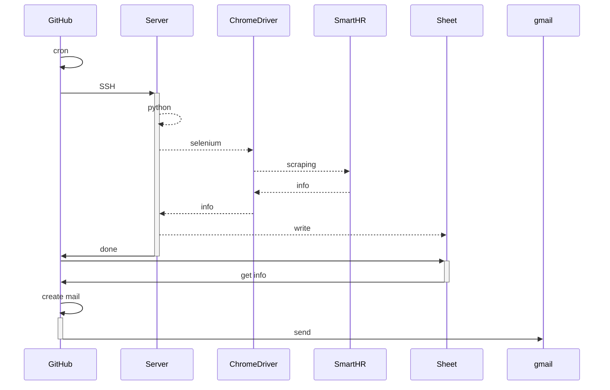

# githubactions-test
GitHub Actionsのテストです

[]([https://github.com/serna37/salary-notificator/actions/workflows/cron.yml](https://github.com/serna37/githubactions-test/actions/workflows/blank.yml))

---

#### App Profile
<!-- Badges -->
<table>
  <tr>
    <td>Lang</td>
    <td>Editor</td>
  </tr>
  <tr>
    <td>
      
      
    </td>
    <td>
      
    </td>
  </tr>
</table>

- [Author Profile](https://github.com/serna37)

---

# OVER VIEW
<div>
  <a href="https://mermaid-js.github.io/mermaid-live-editor/edit#pako:eNpVjstqw0AMRX9FaNVC_ANeFBq7zSbQQrPzZCFsOTMk80CWCcH2v3ccb1qtxD3nCk3Yxo6xxP4W760lUTjVJkCe96ay4gb1NJyhKN7mAyv4GPgxw_7lEGGwMSUXLq-bv18lqKbjqjGodeG6bKh69r8Cz1A3R0oa0_kvOd3jDB-N-7b5_H9ihXPrs-mp7KloSaAieSq4Q8_iyXX5_WlNDKplzwbLvHYkV4MmLNmjUePPI7RYqoy8wzF1pFw7ugj5LVx-AfLqVWg">
    
  </a>
</div>



---

# Usage
## 基本運用
- cron起動のためほっとくだけ

## メンテ作業
- `sample.py`を修正
- ブランチ`main`に直接コミット
  実行時、サーバ上でdevelopをpullするため、これで終了

---

# Build & Deploy

> [!Note]
> - `GitHub Actions`でSSH接続する場合`シークレット`が必要。([ref](https://qiita.com/0622okakyo/items/5295b7b13daf3c35b3e1))
> - https://github.com/{ユーザ名}/{レポジトリ名}/settings/secrets/actions
> - `README.md`のバッチ等で`workflow`の成功を確認 ※ブランチに注意する

```shell
gh secret set HOST --body 'ホスト名'
gh secret set PORT --body '22'
gh secret set USERNAME --body 'ユーザ名'
gh secret set PASSWORD --body 'パスワード'
gh secret set MAIL_HOST --body 'smtp.gmail.com'
gh secret set MAIL_PORT --body '465'
gh secret set MAIL_USERNAME --body 'ユーザ名'
gh secret set MAIL_PASSWORD --body 'パスワード'
gh secret set MAIL_FROM --body 'test@gmail.com'
gh secret set MAIL_TO --body 'test@gmail.com,test2@gmail.com'
```

<details>

<summary>事前準備</summary>

### サーバ側でGitレポをクローンし、以下コマンドで認証不要にしておく。
`$GITHUB_TOKEN`はGitHubログインのトークン。
```shell
git remote set-url origin https://$GITHUB_TOKEN@github.com/{ユーザ名}/githubactions-test.git
```

</details>

---

# Note

- GitHub ActionsからGmail送信の準備 (2段階認証、アプリパスワード作成)<br>
https://zenn.dev/nakamura196/articles/789122b57d595b
